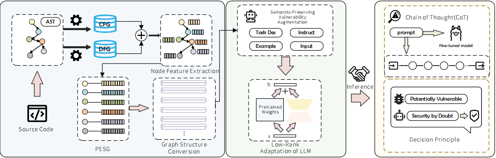

# VulPESR
VulPESR is a vulnerability detection method that integrates semantic topology enhancement with chain-of-thought reasoning to achieve transparent and traceable vulnerability identification in C/C++ source code.

# Approach


## Access to datasets
lianjie

## Figure

We put the images involved in the paper in the folder `Figs\` 

## Install dependencies

Please install them first.

```
unzip VulPESR.zip
cd VulPESR_main
conda create -n vulpesr python=3.9 
conda activate vulpesr
pip install -r requirements.txt
```
## About the Models

In the replication, we provide:

* `analyze_cpg.scala` : Used to extract code analysis graphs
* `convert_data.py` : Used to format data
* `agument_data.py` : Used to augment training data
* `finetuning.py` : Used to fine-tune LLMs
* `inference.py` : Used for chain-of-thought reasoning
* `./to_graph` : Used to process data

## References
Codellama
llama2
starcoder2
